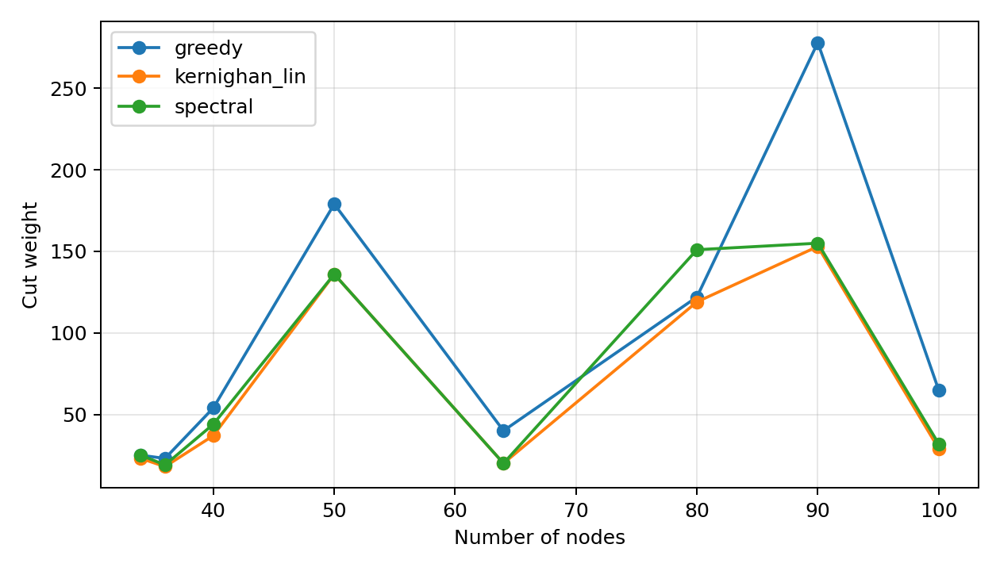
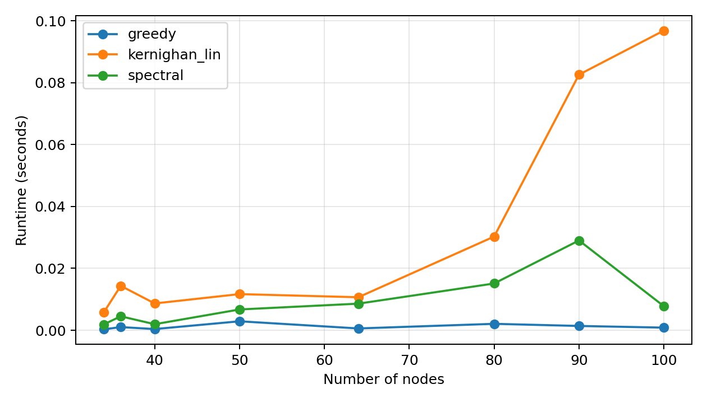
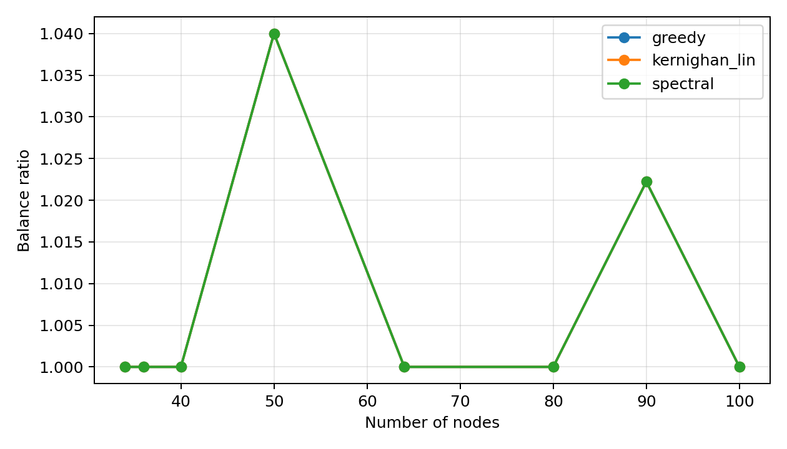

# CS240 课程项目

本仓库包含 **CS240：算法设计与分析，2026 年春季学期** 的课程项目材料。

## 项目选题

**面向通信高效分布式优化的可扩展图划分算法**

本项目基于 **Topic 2: Community Detection / Graph Partitioning**，并将应用场景
调整为分布式优化：利用图划分减少跨 worker 通信，同时保持计算负载均衡。

## 已实现方法

- 贪心均衡划分基线
- 递归谱二分
- 用于 k 路划分的 Kernighan--Lin 成对细化
- 用于跨分区通信分析的一致性平均仿真

## 项目结构

| 路径 | 说明 |
| --- | --- |
| `src/graphs.py` | 图生成与 benchmark 图加载 |
| `src/algorithms.py` | 贪心、谱划分和 Kernighan--Lin 划分方法 |
| `src/metrics.py` | 割边权重、归一化割和均衡性指标 |
| `src/simulation.py` | 一致性平均仿真 |
| `src/experiments.py` | 端到端实验入口 |
| `src/plotting.py` | 图像生成 |
| `tests/` | 轻量级单元测试 |
| `outputs/` | 生成的 CSV 结果和实验图 |
| `Proposal.tex`, `Proposal.pdf` | 英文项目提案 |
| `Proposal.zh.tex`, `Proposal.zh.pdf` | 中文项目提案 |
| `Report.tex`, `Report.pdf` | 英文实验报告 |
| `Report.zh.tex`, `Report.zh.pdf` | 中文实验报告 |

## 环境配置

创建并激活虚拟环境：

```bash
python -m venv .venv
.\.venv\Scripts\Activate.ps1
```

安装依赖和本地包：

```bash
python -m pip install -r requirements.txt
python -m pip install -e .
```

## 运行实验

```bash
python src/experiments.py --output-dir outputs --seed 7
```

该命令会生成：

- `outputs/partition_results.csv`
- `outputs/figures/cut_weight.png`
- `outputs/figures/runtime_seconds.png`
- `outputs/figures/balance_ratio.png`
- `outputs/figures/consensus_error.png`

## 运行测试

```bash
python -m pytest
```

## 编译文档

```bash
pdflatex Proposal.tex
xelatex Proposal.zh.tex
pdflatex Report.tex
xelatex Report.zh.tex
```

如果 PDF 书签或目录信息需要刷新，可以将对应命令再运行一次。

## 结果概览

当前实验结果显示，Kernighan--Lin 细化方法在平均割边权重和跨分区通信量上表现
最好。谱划分在结构化的网格图和随机几何图上也有较强表现。

<table>
  <tr>
    <td></td>
    <td></td>
    <td></td>
  </tr>
  <tr>
    <td align="center">割边权重</td>
    <td align="center">运行时间</td>
    <td align="center">负载均衡比例</td>
  </tr>
</table>

## 已知差异

原始 Kernighan--Lin 论文主要关注图二分。本项目将成对 Kernighan--Lin 二分作为
k 路划分的细化步骤，并使用谱划分作为初始划分。一致性仿真保持底层通信图不变，
只用划分统计跨 worker 消息数，因此划分影响的是通信放置方式，而不是一致性
动力学本身。
